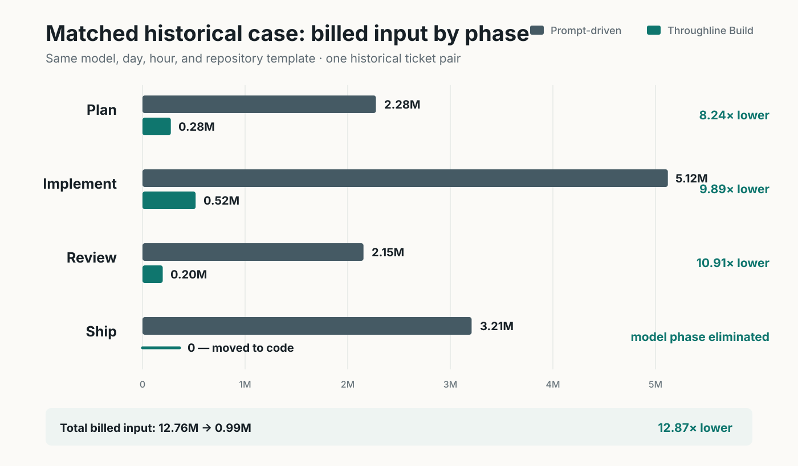
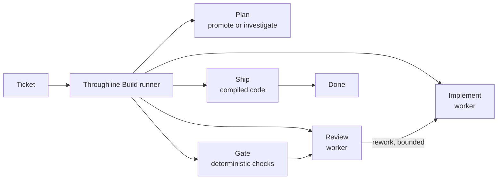
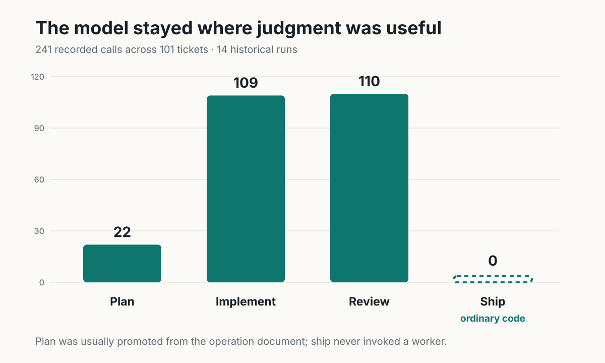
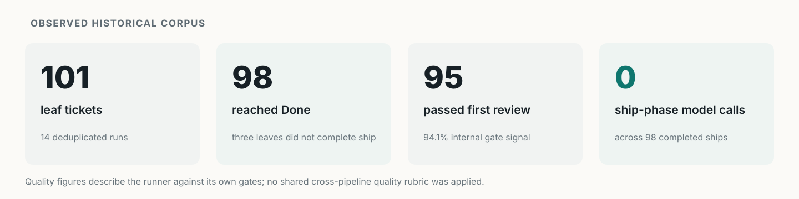

# Throughline Build token-efficiency case study

**A reproducible historical analysis of moving ticket orchestration out of repeated model prompts and into deterministic code.**

In one matched full-lifecycle case, the Throughline Build runner used **12.87x fewer billed input tokens** than my earlier prompt-driven workflow. Across the broader 101-ticket corpus, **98 ship transitions completed with zero model calls**.



| Signal | Observed result | Boundary |
|---|---:|---|
| Matched full workflow | **12.87x lower billed input** | One same-model, same-day historical case |
| Matched historical cost | **$41.24 -> $4.68** | Same pinned May 25, 2026 rate card applied to both arms |
| Plan phase | **roughly 9x-15x lower** | Descriptive sensitivity cuts; observations are clustered |
| Completed ship transitions | **98 with 0 model calls** | Direct event-log observation |
| First-review pass | **95 / 101 (94.1%)** | Internal runner gate signal, not cross-pipeline quality parity |
| Evidence package | **101 tickets / 241 calls / 14 runs** | Deduplicated historical corpus |

> **Careful summary:** In this historical corpus, a deterministic runner used roughly an order of magnitude fewer billed input tokens than the earlier prompt-driven workflow, including 12.9x fewer in one matched case, and recorded no model calls in 98 completed ship transitions.

## What this repository represents

I designed and built **everything on both sides of this comparison**:

- **Claude-Config**, the earlier Markdown slash-command corpus;
- **Throughline Build**, the ground-up deterministic replacement;
- the shared event model and usage instrumentation;
- the extraction and normalization harness;
- the reproducibility scripts and this analysis.

I have dogfooded Throughline Build as my evolving development harness since **January 2026**. This is therefore not a vendor benchmark or a comparison against somebody else's weak implementation. It is a measured redesign of my own working system.

The repository freezes the evidence. The product has continued to evolve.

## The architectural change

The earlier workflow used an interactive coding-agent session as worker, runtime, state machine, and tool gateway. A human invoked one slash command per phase, and the model repeatedly interpreted workflow policy, reconstructed state, selected tools, and performed deterministic operations.

Throughline Build makes one binary responsible for the lifecycle and calls workers only where judgment is useful.



| Prompt-driven workflow | Throughline Build |
|---|---|
| Human invokes each phase | One command drives the lifecycle |
| Prompt text is the control plane | Compiled code owns control flow |
| Model manages state and transitions | Explicit deterministic state machine |
| Model performs git, API, and ship operations | Ordinary code performs deterministic side effects |
| Session carries or reconstructs broad context | Workers receive phase-scoped briefs |
| Model is worker **and** orchestrator | Model is reserved for judgment-heavy work |

The result is not "a better prompt." It is a different systems boundary.

## Why I built it

The trigger was a real seven-ticket TradeTrack2 chain in the older harness. My original production postmortem recorded about four hours of runtime and roughly 190 million cache-read tokens while the conversation repeatedly carried a 26K-token operating corpus.

I was on a flat-rate subscription, so that observation was not an invoice. It was a warning: the system was spending model context on remembering and operating the workflow rather than on the software work itself.

Throughline Build began as an attempt to make that cost visible and bounded. It became the native harness I use to build the rest of my projects.

## What the corpus says

### Matched full-lifecycle case

| Phase | Prompt-driven billed input | Throughline Build billed input | Reduction |
|---|---:|---:|---:|
| Plan | 2,275,192 | 276,140 | **8.24x** |
| Implement | 5,120,701 | 517,891 | **9.89x** |
| Review | 2,154,159 | 197,461 | **10.91x** |
| Ship | 3,207,684 | **0** | moved to code |
| **Total** | **12,757,736** | **991,492** | **12.87x** |

The model-using phases improved independently of ship: plan, implement, and review each recorded roughly 8x-11x less billed input. Ship then disappeared as a model phase because git operations, ticket writes, and state transitions moved into compiled code.

### Where the model remained



Only 22 of 241 calls were planning calls because the runner normally promotes an existing operation-document brief. Implementation and review remain worker tasks. Ship does not invoke a worker.

### Did it still complete work?



Those delivery numbers show that the runner passed its own gates at a high rate. They do **not** prove output parity with Claude-Config: the two systems were never scored with one shared quality rubric.

## Why the negative results are included

The evidence package retains findings that make the story less tidy and more useful:

- one lower-token GPT-5.5 chain failed to converge and shipped nothing;
- runner iterations produced regressions as well as improvements;
- a configured warm-batch path was unreachable in every measured run;
- a no-rework near-replicate recorded 1.87x more cache reads than a run with two rework rounds;
- the older prompt-side corpus is closed because its source transcripts were deleted;
- quality parity between the two generations remains formally unestablished.

A lower token count is not a win if the work does not land. A passing gate is not evidence if the gate cannot fail. A benchmark is not credible if failed paths disappear from the folder.

## Historical corpus, not a current model leaderboard

The measured runs are a point-in-time record from May and June 2026. By runs 09-14, the focus had shifted from establishing the primary result to optimizing and diagnosing the runner. The operation document, embedded instructions, runner code, and worker did not remain independently controlled.

Run 14 used the **original Fable 5** available at the time. It should not be treated as a comparison with later Fable variants. The corpus contains no 5.6 or Sol runs, and it makes no claim about the best worker today.

Current Throughline Build is newer than the measured runner. This repository deliberately does not mix later unmeasured improvements into the historical evidence.

## Start here

1. [`deterministic-runner-token-reduction.md`](deterministic-runner-token-reduction.md) - full technical report, evidence boundaries, and appendices.
2. [`findings/chain-efficiency-briefing.md`](findings/chain-efficiency-briefing.md) - forensic investigation behind the context and convergence findings.
3. [`findings/chain-efficiency-evidence.md`](findings/chain-efficiency-evidence.md) - compact supporting evidence.
4. [`workloads/survey-app-build.md`](workloads/survey-app-build.md) - what the workers actually built.

## Reproduce every quantitative table

Python 3 and the standard library are sufficient. No package install, network access, API keys, or provider credentials are required.

```sh
cd scripts
python agg_lf.py     # Run first; writes lf_rows.json
python stats.py      # Matched case, plan comparison, ship observations
python sens.py       # Descriptive sensitivity cuts
python models.py     # Worker inventory and historical iteration series
python quality.py    # Verdicts, rework, and ship side effects
python sanitize_publication.py  # Verifies the vendored JSONL is already minimized
```

Regeneration is deterministic. Rerunning the scripts against the vendored analysis rows should produce the same derived rows and quantitative values. The SVGs in `assets/` are presentation renderings of those values.

## Repository map

| Path | Purpose |
|---|---|
| `data/` | Sanitized, analysis-ready inputs; see `data/README.md` |
| `scripts/` | Five standard-library analysis scripts |
| `workloads/` | Operation documents defining the recorded workloads |
| `findings/` | Supporting qualitative investigations and evidence notes |
| `method/` | Prompts and procedures used to measure and compare runs |
| `engine-iteration/` | Feedback -> plan -> implementation history; provenance, not benchmark evidence |
| `assets/` | Report and README visualizations |

## Claim boundaries

- The **12.87x** result is one matched historical full-lifecycle case.
- The **9x-15x** plan result is descriptive; observations are clustered and no independent-sample confidence interval is claimed.
- The plan comparison contains a model confound, although the prompt-side Opus-only cut remains **9.69x**.
- The **98 zero-call ship transitions** are direct observations from these runner versions, not a guarantee about every future version.
- Runner quality signals measure the runner against its own gates; they do not establish cross-pipeline output parity.
- Prompt-driven wall time is not recoverable and must not be compared with runner subprocess time.
- Every measured runner execution was a cold-start path because batch implementation was not actually reachable.
- Absolute dollar figures are historical and pricing-card dependent. Token ratios are rate-independent.

## Data provenance

Prompt-driven command regions were extracted from Claude Code transcripts and normalized into the same event shape emitted natively by Throughline Build. Model calls are deduplicated by `SessionId`; verdicts and state changes are deduplicated by full event identity.

Before publication, the vendored rows were reduced to an allowlisted schema. Session identifiers and build versions are stable synthetic labels; backend identifiers, paths, commit SHAs, review prose, and raw check output were removed. The sanitizer is deterministic and the quantitative scripts produce the same reported values before and after minimization.

One runner execution survived only as a loose `claude-chain2.json` and is explicitly included. The prompt-driven corpus cannot be extended without rerunning the old system because its originating transcripts no longer exist.
