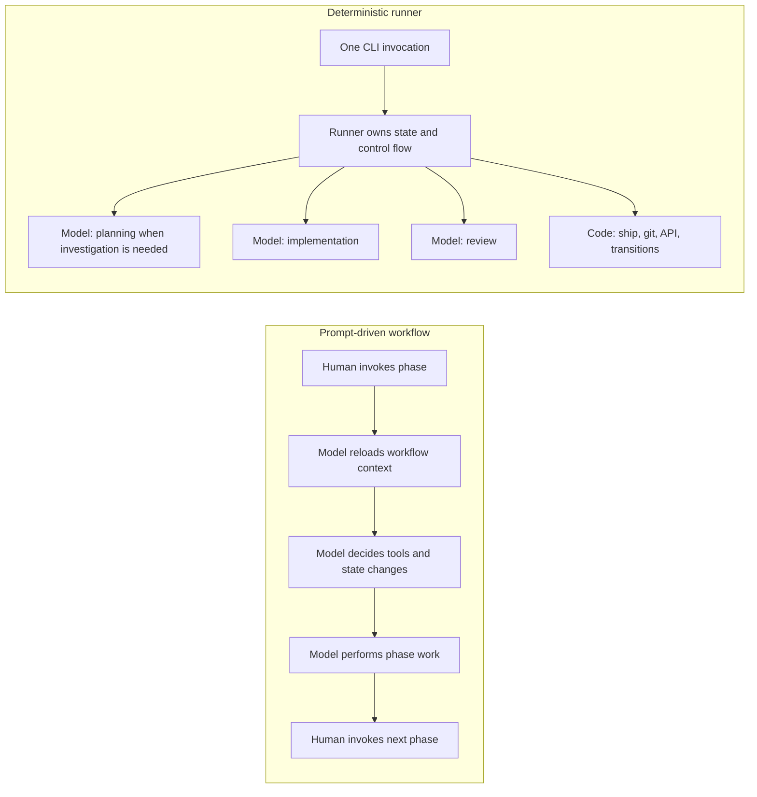
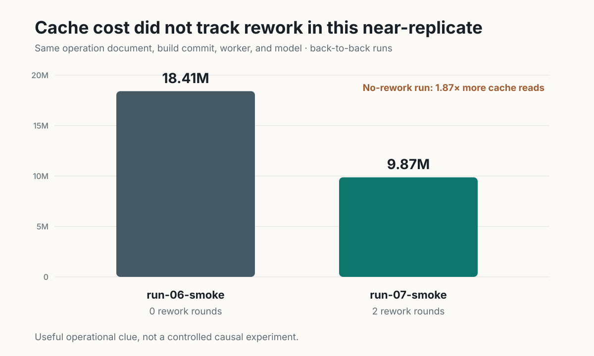

# Moving ticket orchestration out of the model

## A reproducible historical case study from Throughline Build

> **Evidence scope:** closed analysis of historical runs recorded on May 26, 2026 and June 5–10, 2026. No new runs were commissioned for this report. Every quantitative result is derived from logs already present on disk.
>
> **Authorship and system context:** the same author independently designed and built the prompt-driven baseline, Throughline Build, the instrumentation, the comparison harness, the normalization scripts, and this analysis. Throughline Build was built from scratch and has served as the author's evolving development harness since January 2026. The current product has continued to evolve; this report intentionally freezes the historical evidence rather than attaching newer, unmeasured claims to it.

A prompt-driven agent workflow can spend a surprising amount of context on the workflow itself: reloading instructions, reconstructing state, selecting tools, and asking a model to perform operations that ordinary code can handle deterministically.

This project tested a different systems boundary. It replaced a human-stepped sequence of Claude Code slash commands with a deterministic runner that owns control flow, ticket state, gates, transitions, git operations, and shipping. The model remains in the loop where judgment is useful—investigation, implementation, and review—but it is no longer the workflow engine.

The redesign was motivated by production use rather than a synthetic benchmark. The author's original production postmortem describes one seven-ticket TradeTrack2 chain that took about four hours and logged roughly 190 million cache-read tokens while carrying a 26K-token operating corpus through a persistent conversation. That anecdote explains why the system was rebuilt; it is not one of the vendored comparison rows and is not used as a normalized result in this report.

## Results at a glance

| Result | Observed value | Evidence type |
|---|---:|---|
| Billed input tokens, matched full workflow | **12.87× lower** | One matched historical case: same model, day, hour, and repo template |
| Historical cost, matched full workflow | **8.81× lower** | Same pinned rate card applied to both pipelines |
| Plan-phase billed input | **about 9×–15× lower** | Descriptive sensitivity cuts; clustered observations |
| Model calls during completed ship transitions | **0 across 98 transitions** | Directly observed across the runner corpus |
| First review passed | **95 of 101 tickets (94.1%)** | Internal runner quality signal, not cross-pipeline quality parity |
| Runner corpus | **101 tickets, 241 LLM calls, 14 runs** | Deduplicated event logs |

The most defensible one-sentence summary is:

> **In this historical corpus, a deterministic ticket runner used roughly an order of magnitude fewer billed input tokens than the earlier prompt-driven workflow, including 12.9× fewer in one matched case, while recording no LLM calls in 98 completed ship transitions.**

That is a case-study result, not a universal benchmark. The evidence boundaries are stated explicitly below.

---

## 1. The engineering question

The experiment was not primarily a model comparison. It asked a systems-design question:

> **How much model usage comes from doing the software work, and how much comes from repeatedly asking the model to operate the workflow around that work?**

Both pipelines move a ticket from backlog to shipped. They differ in where control lives.

| | Prompt-driven workflow | Deterministic runner |
|---|---|---|
| Public name in the corpus | claude-config `/ticket-*` commands | Throughline Build `build` |
| Invocation | A human invokes `/ti`, `/ta`, `/tr`, and `/tsh` one phase at a time | One CLI invocation drives plan → implement → review → ship |
| Phase control | Prompt text is interpreted by the model on every phase | Compiled control flow |
| Ticket state and transitions | Model-directed tool calls | Deterministic code paths |
| Git and shipping operations | Performed through the model | Performed by code |
| Model responsibility | Work product **and** workflow operation | Judgment-heavy work product only |
| Context shape | Interactive session context is repeatedly carried forward or reconstructed | Each worker receives a phase-scoped brief |



The prompt-driven baseline was not intentionally weak. It was the author's previous production harness: a tuned workflow that had already shipped real tickets. The comparison is therefore between two credible generations of one working development system, not between a polished runner and a toy prompt. Shared authorship also removes ambiguity about who implemented the intervention, although it does not provide independent replication.

---

## 2. Dataset, provenance, and metric definition

### Corpus

The analysis-ready events are vendored under [`data/`](data/), allowing every quantitative table to regenerate from this repository alone.

| Source | Pipeline | Contents |
|---|---|---|
| `data/arm-a/runs.jsonl` | Prompt-driven | 13 recovered slash-command regions after deduplication |
| `data/arm-a/matched-pair-ticket-6/*.jsonl` | Prompt-driven | SURCC-6, all four phases, Opus 4.7 |
| `data/arm-b/matched-pair-ticket-6/*.jsonl` | Runner | SURLF-6, all four phases, Opus 4.7 |
| `data/arm-b/events/<run>/*.jsonl` | Runner | 14 full runs |

After deduplication, the runner corpus contains:

- **2,745 events**
- **241 LLM calls**
- **101 leaf tickets**
- **14 runs**
- **989.4 minutes of measured subprocess wall time**

LLM calls are deduplicated by `SessionId`; verdicts and state changes are deduplicated by full event identity. This matters because one recovered run survived only as a loose `claude-chain2.json`, and duplicate files must not inflate totals.

### Primary metric

**Billed input tokens** are defined as:

```text
input + cache_read + cache_create
```

This is the primary metric because it captures how much context the workflow pushes through the model, including cached context that is still billed.

Output tokens are reported separately. They indicate how much text the model emitted, but they are not treated as a direct measure of quality or completed work.

### Pricing

Dollar values use the pinned rate card in `data/pricing.toml`, dated May 25, 2026. Both pipelines are priced with the same card. Token ratios are rate-independent; absolute dollar figures are historical and should not be presented as current vendor pricing.

Four runner plan calls use OpenAI accounting, where cached input is included within the reported input total. The analysis counts that total once rather than adding the cached subset again. Claude-only sensitivity cuts remove this accounting difference entirely.

---

## 3. Matched full-workflow case

The cleanest comparison is a matched ticket pair run through both pipelines on the same day, with the same model, within minutes of each other, against the same Vite scaffold workload.

- Prompt-driven ticket: `SURCC-6`
- Runner ticket: `SURLF-6`
- Model: Opus 4.7
- Compared phases: plan, implement, review, ship

### Per-phase result

| Phase | Prompt-driven billed input | Runner billed input | Reduction | Prompt-driven cost | Runner cost | Cost reduction |
|---|---:|---:|---:|---:|---:|---:|
| Plan | 2,275,192 | 276,140 | **8.24×** | $9.48 | $1.95 | 4.86× |
| Implement | 5,120,701 | 517,891 | **9.89×** | $14.41 | $1.74 | 8.30× |
| Review | 2,154,159 | 197,461 | **10.91×** | $8.47 | $0.99 | 8.53× |
| Ship | 3,207,684 | **0** | structural elimination | $8.88 | **$0.00** | structural elimination |
| **Total** | **12,757,736** | **991,492** | **12.87×** | **$41.24** | **$4.68** | **8.81×** |


Output tokens were **117,772 versus 25,918**, a **4.54×** reduction.

### Interpretation

Two different effects contribute to the total:

1. **Efficiency within model-using phases.** Plan, implement, and review each used roughly 8×–11× fewer billed input tokens.
2. **Structural elimination of an unnecessary model phase.** Shipping moved from 3.2 million billed input tokens to zero because git, API, and state-transition work moved into deterministic code.

The matched result demonstrates a large reduction in this case. It remains one historical case and should be cited as such—not as an estimate of the average future ticket.

---

## 4. Plan-phase comparison across the historical corpus

The broader plan-phase corpus contains 10 recovered prompt-driven `/ti` regions and 23 runner plan calls.

These are useful observations, but they are not 33 independent experiments. Twenty-two runner calls are clustered within four runs, and six prompt-driven observations share one recorded baseline context. The analysis therefore reports descriptive distributions and sensitivity cuts rather than an independent-sample p-value or confidence interval.

### Billed input distribution

| | n | Mean | Median | Geometric mean | Minimum | Maximum |
|---|---:|---:|---:|---:|---:|---:|
| Prompt-driven `/ti` | 10 | 4,000,630 | 3,207,142 | 3,067,587 | 1,146,348 | 12,279,532 |
| Runner plan | 23 | 288,493 | 235,741 | 236,825 | 43,795 | 1,017,950 |

- Ratio of medians: **13.60×**
- Ratio of means: **13.87×**
- Ratio of geometric means: **12.95×**

The distributions are completely separated in the observed data: the least expensive prompt-driven plan region, at 1,146,348 billed input tokens, is still larger than the most expensive runner plan call, at 1,017,950.

That is a property of this corpus, not a claim about the probability of future runs.

### Output tokens

| | n | Mean | Median | Minimum | Maximum |
|---|---:|---:|---:|---:|---:|
| Prompt-driven | 10 | 61,356 | 36,401 | 7,505 | 269,481 |
| Runner | 23 | 10,459 | 8,806 | 4,990 | 22,195 |

Output-token distributions overlap. Their median ratio is **4.13×**, materially smaller than the input-token ratio. That asymmetry is important: the largest observed difference is in context carried into the model, not merely in the amount of text generated.

### Sensitivity cuts

| Cut | n, prompt / runner | Median ratio | Mean ratio | Call-level separation |
|---|---:|---:|---:|---|
| All data | 10 / 23 | 13.60× | 13.87× | Yes |
| Exclude GPT-5.5 from runner | 10 / 19 | 14.94× | 14.65× | Yes |
| Exclude prompt-driven maximum | 9 / 23 | 9.73× | 10.68× | Yes |
| Prompt-driven Opus 4.7 only | 8 / 23 | 9.69× | 12.79× | Yes |
| Both trimmed | 8 / 19 | 10.64× | 13.51× | Yes |
| Runner Sonnet 4.6 only | 10 / 18 | 15.23× | 14.66× | Yes |

Across the cuts, observed mean and median ratios remain between approximately **9× and 15×**, and every cut retains call-level separation.

---

## 5. Shipping became ordinary software

Shipping is the most direct evidence in the report because the mechanism is visible in both the implementation and the event stream.

| Runner ship signal | Observed value |
|---|---:|
| Leaf tickets observed | 101 |
| Ship-phase LLM calls | **0** |
| Ship transitions reaching `Done` | **98** |
| `base_ref_resolved`, `baseline_computed`, and `create_comment` events | 98 each |
| `fetch_skipped` events | 99 |
| `fixes_detected` events | 89 |

All 98 completed ship transitions ran without a model call. The remaining three leaf tickets did not complete shipping, so the evidence is specifically about the completed transitions in the corpus.


This distinction matters. The reduction is not only “better prompting.” The runner changes the boundary between probabilistic work and deterministic work:

- Reviewing code can require judgment, so a model remains useful.
- Resolving a base ref, posting a comment, deleting a branch, or moving a ticket to `Done` follows a known procedure, so ordinary code is the more reliable and less expensive tool.

---

## 6. Did the less expensive pipeline still deliver?

A token reduction is not useful if it comes from abandoning difficult work or weakening gates. The runner event log provides an internal delivery signal:

| Signal | Observed value |
|---|---:|
| Review verdicts | 100 Pass / 10 Rework |
| First review verdict per ticket | 95 Pass / 6 Rework |
| First-pass review rate | **94.1%** |
| Tickets needing more than one implementation round | 6 of 101 (5.9%) |
| Review sessions with zero failed checks | 105 of 110 |
| Tickets reaching `Done` | 98 |
| Implement-worker verdicts | 109 `Ok` of 109 |

All 10 Rework verdicts occurred in three runs: the earliest smoke run, one later smoke run, and the GPT-5.5 run that failed to converge. Seven mature Claude-worker runs recorded **57 Pass and 0 Rework**.


These signals establish that the runner completed its own checks and gates at a high rate. They do **not** establish output-quality parity with the prompt-driven baseline because the two pipelines were never graded with a shared rubric. That comparison remains unmeasured.

---

## 7. What is consistent with the reduction

The corpus supports several mechanism explanations. Zero ship-phase calls and plan promotion are directly observable. Other causal interpretations are consistent with the architecture and token shape but were not isolated through controlled ablations.

| Design change | Direct observation | Why it can reduce model use |
|---|---|---|
| Phase-scoped briefs | Matched plan input fell from 2.28M to 276K | The model receives the brief and relevant context instead of repeatedly carrying the interactive workflow history |
| Deterministic shipping | 0 ship calls across 98 completed transitions | Known git/API/state procedures no longer consume model context or output |
| Plan promotion | Only 22 of 241 runner calls were plan-phase | Most briefs are promoted from the operation document; a planner is invoked only for `mode = "investigate"` |
| Compiled control flow | State transitions are emitted as runner events | The model no longer has to reinterpret phase policy on every invocation |

### The gap is primarily in input context

In the matched case:

- billed input differed by **12.87×**
- output differed by **4.54×**

Both pipelines were cache-read dominated—93.9% of billed input in the prompt-driven case and 92.7% in the runner case. The runner did not win by moving tokens into a different billing category. It presented a much smaller recorded working set per call.

---

## 8. Engineering findings beyond the headline

The investigation surfaced several results that matter for building reliable agent infrastructure, even though they are not the primary benchmark claim.

### 8.1 Cache reads were a poor proxy for rework

Two back-to-back runner runs used the same recorded operation document, build commit, worker, and model.

| | `run-07-smoke` | `run-06-smoke` |
|---|---:|---:|
| LLM calls | 20 | 16 |
| Rework rounds | 2 | **0** |
| Cache-create tokens | 837,718 | 749,239 |
| Cache-read tokens | 9,869,143 | **18,412,242** |
| Cache-read / cache-create | 11.8× | **24.6×** |
| Output tokens | 263,670 | 244,056 |
| Wall time | 80.9 min | 73.4 min |

The run with no rework recorded **1.87× more cache reads**. Unique context written was similar; the difference was repeated reads within the sessions.



The useful engineering conclusion is not “minimize turns at any cost.” Some exploration is how an agent gets the work right. The target is unnecessary exploration: discovery that could have been replaced by a file map, context that could have been preloaded, or edits that could have been batched.

### 8.2 The corpus accidentally measured the cold-start path only

The `--batch-implement` option was accepted and threaded into configuration, but the runner version used for these experiments constructed `ChainPhase` without the required `batchWorker` argument. The option silently degraded to cold, per-ticket sessions.

That path has since been wired, but no run in this dataset used the warm batched implementation. Every observed ticket paid a fresh context-establishment cost.

This is both a limitation and an engineering finding:

- the reported result is not evidence of warm-batch performance;
- the 9×–15× descriptive reduction was achieved before the optimization aimed at the dominant repeated-read cost was active;
- the analysis found a real composition bug rather than merely producing a favorable chart.

### 8.3 Lower token volume is not savings if the chain does not finish

A GPT-5.5 run through the same runner showed a lower per-call implementation median than the Sonnet 4.6 runner calls. It also failed to converge on ticket 11, exceeded the configured rework cap, stopped the parent chain, and landed nothing on the target branch.

Approximately 66 minutes of work produced zero shipped tickets.

The review loop was not silent: it identified specific in-scope defects while automated build and test checks were green. The implementer did not converge before `MaxReworkRounds = 2`.

This is why the report does not headline the lower GPT-5.5 token count. A stranded run is not cheaper in the operational sense that matters. The corpus does not isolate a vendor effect because runner builds and execution conditions also differed.

### 8.4 The later runs document engineering iteration, not a current model benchmark

By runs 09–14, the purpose of the work had shifted from establishing the primary architectural result to optimizing and diagnosing the runner. The series records successive runner versions and embedded phase instructions; it is not a set of model-only replicates.

| Run | Worker | Operation document | Billed input | Change from prior | Output | Wall time |
|---|---|---|---:|---:|---:|---:|
| 09 | Sonnet 4.6 | exp-1 | 19,535,726 | — | 254,459 | 82.3 min |
| 10 | Sonnet 4.6 | exp-2 | 24,213,893 | +23.9% | 280,105 | 87.8 min |
| 11 | Sonnet 4.6 | exp-3/4 | 19,823,514 | -18.1% | 229,115 | 72.2 min |
| 12 | Sonnet 4.6 | exp-3/4 | 23,915,591 | +20.6% | 280,361 | 91.7 min |
| 13 | Sonnet 4.6 | exp-3/4 | 22,586,809 | -5.6% | 248,343 | 84.7 min |
| 14 | Fable 5 | exp-3/4 | 11,273,166 | -50.1% | 201,369 | 57.7 min |

Run 10 added preloading but the mechanism silently did not execute. Run 11 fixed it and emitted eight `preload_summary` events. Later builds added context attribution, context-hygiene controls, sweep and integration behavior, worker-result parsing, and phase changes.

Run 14 used the **original Fable 5 worker available at the time** and recorded roughly half the billed input of run 13. Both the worker and runner changed, however, so it is an endpoint observation rather than an estimate of Fable's independent effect. It is also not an apples-to-apples comparison with later Fable variants. The corpus contains no 5.6 or Sol runs and should not be read as a statement about the current worker landscape.

The non-monotonic series remains useful as evidence of a real engineering loop: changes were instrumented, regressions remained visible, and aggregate movement was not assigned to a mechanism unless telemetry showed that the mechanism actually ran.

---

## 9. Evidence boundaries

The report uses four levels of claim strength.

| Claim type | What can be said | What should not be said |
|---|---|---|
| Direct corpus observation | No ship-phase LLM calls occurred across 98 completed transitions | The runner can never call a model during shipping in any future version |
| Matched historical case | One same-model, same-day case used 12.87× fewer billed input tokens | The average future ticket will always be 12.87× lower |
| Descriptive corpus result | Plan-phase cuts were about 9×–15× lower and did not overlap in the observed calls | The calls form an independent randomized sample or establish a confidence interval |
| Exploratory engineering result | Version changes, worker changes, cache behavior, and a failed cross-vendor run reveal useful directions | Any one model or optimization caused the aggregate change without an isolated ablation |

### Specific threats to validity

1. **The full workflow comparison is n=1.** It is a matched case study, not a population estimate.
2. **Plan observations are clustered.** The report intentionally avoids an independent-sample p-value or confidence interval.
3. **The plan comparison has a model confound.** The prompt-driven sample is mostly Opus 4.7; the runner sample is mostly Sonnet 4.6. The Opus-only cut remains 9.69×, but the confound is not eliminated.
4. **Cross-pipeline quality parity is unmeasured.** Runner outcomes were evaluated by runner gates only.
5. **Prompt-driven wall time is unavailable.** The audit timestamps record message-to-first-response gaps, not complete execution duration. They must not be compared with runner subprocess wall time.
6. **Different workloads must not be pooled.** The matched Vite ticket cannot be normalized against the separate 81-ticket survey workload.
7. **The prompt-driven corpus is closed.** The originating Claude Code transcripts were deleted, so expanding that arm requires rerunning the old workflow.
8. **The prompt-driven input distribution is right-skewed.** The sensitivity table retains and removes its 12.28M maximum explicitly.
9. **Runs 09–14 changed over time.** They show version-to-version movement, not isolated treatment effects. Run 14 used the original Fable 5 available then; later Fable variants, 5.6, and Sol are outside the corpus.
10. **All runner observations are cold-start executions.** Warm batching was unreachable in the versions that generated this corpus.
11. **The measured runner is not the current product.** Throughline Build continued to evolve after the corpus closed. Later functionality is described as current status only when sourced from the codebase; no later performance number is implied.

The limitations constrain the claims; they do not erase the directly observed differences.

---

## 10. Reproduce the analysis

Every quantitative table and underlying value regenerates with Python 3 and the standard library. No network access, API key, package installation, or unpublished source repository is required. The included SVGs are presentation renderings of values reported in those tables.

```sh
cd scripts
python agg_lf.py     # Run first; writes lf_rows.json
python stats.py      # Matched case, plan comparison, ship observations, Arm A appendix
python sens.py       # Descriptive sensitivity cuts
python models.py     # Model inventory and runner iteration series
python quality.py    # Verdicts, rework, and ship side effects
```

Regeneration is deterministic. The full folder map, source provenance, and corpus inventory are documented in [`README.md`](README.md).

Cost arithmetic was independently re-derived from `data/pricing.toml` and matches the original matched-ticket analysis to the cent across all eight phase figures.

---

## 11. Visual reading guide

The included figures are deliberately limited to claims the corpus supports.

| Figure | Question answered | Required interpretation |
|---|---|---|
| Matched phase bars | Did the architecture materially change input volume across the lifecycle? | One matched historical case; ship is a structural elimination, not merely a smaller bar |
| Calls by phase | Where did Throughline Build still use a worker? | Direct 14-run corpus count; zero in ship applies to the recorded versions |
| Delivery scorecard | Did the runner still complete its own workflow? | Internal gate outcomes, not a shared cross-pipeline quality grade |
| Cache near-replicate | Did cache cost track rework? | Useful paired observation, not a controlled causal experiment |

The run 09–14 iteration series is retained in tabular form because a prominent line chart can too easily be mistaken for a model leaderboard. Historical dollar values are also kept secondary: token ratios are durable, while price cards age.

---

<details>
<summary><strong>Appendix A: every recovered prompt-driven command region</strong></summary>

| Command | Model | Label | Billed input | Output | Cost at pinned card |
|---|---|---|---:|---:|---:|
| `/tch` | Opus 4.7 | baseline-2026-05-20 | 194,472,365 | 1,049,628 | $458.64 |
| `/tch` | Opus 4.7 | baseline-2026-05-20 | 83,759,025 | 372,281 | $203.65 |
| `/ti` | Opus 4.7 | baseline-2026-05-20 | 12,279,532 | 269,481 | $64.36 |
| `/ti` | Sonnet 4.6 | ti-31 | 5,749,144 | 80,439 | $20.68 |
| `/ti` | Haiku 4.5 | tlb-55 | 4,742,041 | 22,057 | $13.25 |
| `/ti` | Opus 4.7 | tlb-54 | 4,551,068 | 87,429 | $19.08 |
| `/ti` | Opus 4.7 | baseline-2026-05-20 | 4,119,956 | 33,092 | $14.85 |
| `/ti` | Opus 4.7 | baseline-2026-05-20 | 2,294,327 | 39,710 | $8.17 |
| `/ti` | Opus 4.7 | SURCC-6 | 2,275,192 | 39,990 | $9.48 |
| `/ti` | Opus 4.7 | baseline-2026-05-20 | 1,678,112 | 13,940 | $5.18 |
| `/ti` | Opus 4.7 | baseline-2026-05-20 | 1,170,582 | 19,922 | $5.20 |
| `/ti` | Opus 4.7 | baseline-2026-05-20 | 1,146,348 | 7,505 | $4.15 |
| `/tn` | Opus 4.7 | baseline-2026-05-20 | 432,832 | 4,260 | $1.72 |

The two `/tch` rows are excluded from the quantitative comparison because the number of tickets covered by each command cannot be recovered and therefore cannot be normalized. They remain visible as provenance.

</details>

<details>
<summary><strong>Appendix B: runner corpus by run</strong></summary>

| Run | LLM calls | Tickets | Output | Cache read | Cache create | Input | Wall time |
|---|---:|---:|---:|---:|---:|---:|---:|
| run-01-smoke | 8 | 1 | 45,416 | 2,361,738 | 211,842 | 507 | 21.1 min |
| run-02-smoke | 24 | 8 | 242,186 | 11,702,815 | 827,858 | 5,313 | 78.9 min |
| run-03-smoke | 24 | 8 | 179,265 | 10,448,065 | 330,599 | 6,196,430 | 67.9 min |
| run-04-smoke | 16 | 8 | 233,595 | 18,220,567 | 702,215 | 324 | 75.0 min |
| run-05-smoke | 12 | 4 | 118,363 | 8,619,151 | 395,507 | 7,104 | 49.6 min |
| run-06-smoke | 16 | 8 | 244,056 | 18,412,242 | 749,239 | 384 | 73.4 min |
| run-07-smoke | 20 | 8 | 263,670 | 9,869,143 | 837,718 | 260 | 80.9 min |
| run-08-smoke | 24 | 8 | 141,141 | 10,305,792 | 0 | 11,946,203 | 66.1 min |
| run-09-experiment | 16 | 8 | 254,459 | 18,889,479 | 643,477 | 2,770 | 82.3 min |
| run-10-experiment | 16 | 8 | 280,105 | 23,550,208 | 659,752 | 3,933 | 87.8 min |
| run-11-experiment | 16 | 8 | 229,115 | 19,224,401 | 598,622 | 491 | 72.2 min |
| run-12-experiment | 17 | 8 | 280,361 | 23,188,108 | 727,120 | 363 | 91.7 min |
| run-13-experiment | 16 | 8 | 248,343 | 21,971,358 | 608,840 | 6,611 | 84.7 min |
| run-14-experiment | 16 | 8 | 201,369 | 10,658,373 | 607,359 | 7,434 | 57.7 min |
| **Total** | **241** | **101** | **2,961,444** | **207,421,440** | **7,900,148** | **18,178,127** | **989.4 min** |

The large `input` values in runs 03 and 08 reflect GPT-5.5's accounting convention, which includes cached input within input and does not report cache creation separately.

</details>

<details>
<summary><strong>Appendix C: runner per-call statistics by worker and phase</strong></summary>

| Worker | Phase | n | Median billed input | Mean billed input | Median output | Median wall time |
|---|---|---:|---:|---:|---:|---:|
| Sonnet 4.6 | Plan | 18 | 210,583 | 272,953 | 9,476 | 223 s |
| Sonnet 4.6 | Implement | 77 | 1,738,553 | 2,063,433 | 17,901 | 365 s |
| Sonnet 4.6 | Review | 78 | 158,956 | 182,835 | 3,292 | 66 s |
| Fable 5 | Implement | 8 | 886,693 | 1,287,832 | 14,968 | 283 s |
| Fable 5 | Review | 8 | 115,919 | 121,313 | 3,157 | 61 s |
| Opus 4.7 | Implement | 7 | 966,733 | 1,061,993 | 8,193 | 234 s |
| Opus 4.7 | Review | 7 | 202,164 | 183,196 | 3,120 | 60 s |
| Opus 4.6 | Implement | 1 | 1,207,405 | 1,207,405 | 9,336 | 405 s |
| Opus 4.6 | Review | 1 | 220,191 | 220,191 | 3,118 | 89 s |
| GPT-5.5 | Plan | 4 | 364,285 | 361,514 | 6,106 | 152 s |
| GPT-5.5 | Implement | 16 | 828,418 | 840,144 | 9,700 | 300 s |
| GPT-5.5 | Review | 16 | 169,077 | 203,351 | 2,309 | 59 s |

No ship row exists because no ship-phase model call was recorded.

</details>
